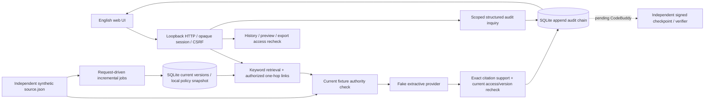

# 实际实现与信任边界 · 2026-10-04

本文件描述代码当前事实；03 仍为完整产品目标，不据本地原型降低目标。

模块：`sources.py` 平台差异 fixture policy + 当前权威；`store.py` 事务存储；`ingestion.py` 幂等/重试/版本切换/删除；`engine.py` 检索、授权、provider 和引用；`audit.py` 事件链与精确分页；`audit_query.py` 有限自然语言模板；`server.py` 身份和 HTTP；`web/` 原生英文 UI。

应用角色与源权限分开。demo 身份选择只在显式 loopback synthetic 模式可用，不能作为真实登录。客户端 role/user_id/tenant 不被业务 API 接受。source.json 由本机演示操作者修改，产品 HTTP 端点没有源写入接口。

索引 ACL 与源权威分离；过期索引不授予访问。已授权 seeds 可一跳扩展原文链接，但每个目标独立检查。当前 evidence ID `resource@version`，定位来自 fixture 原文；链接是 fixture://，不伪造源平台链接。fake provider 仅摘录动态检索内容，不做事实题目硬编码。严格逐条原文支持校验不等于真实模型的语义推理评估。

历史和导出按回答证据依赖重查；任一依赖失效时整条旧回答不再提供。不读取旧版本正文。已展示给浏览器的内容无法远程收回；已发模型的字节也不能逆转。返回前复核只控制后续响应。

当前索引无 embedding；只有对象级文本检索。内容变化只发布变化对象，ACL 变化不重建正文。同步是在下一请求前处理本地持久事件，没有真实后台源 polling/webhook；不宣称达成真实 5 分钟/30 分钟新鲜度。当前受限单进程演示按请求串行化，未验证企业并发规模。

审计正文保存在受保护本地 SQLite，合成资料未加密。SQL authorizer + trigger 测试限制应用连接修改日志，但同账号仍可直接改文件，A-02 独立 DB role 未实现。hash chain 只能检测链一致性；测试外部保存 head 可检查其覆盖区，独立签名 checkpoint 未实现。由 CodeBuddy 独占实现，不能冒充已完成。

生产升级须完成：批准的运行时模型/provider、安全 SSO 与平台用户映射、四源实时授权/内容同步、受支持生产 HTTP 栈、独立 DB 角色与审计保护、签名检查点、部署及 G1/G2。真实 LLM 的 prompt injection、幻觉和外部出口尚未测。
