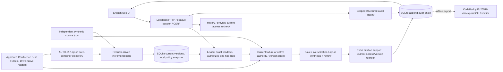

# 实际实现与信任边界 · 2026-10-04

2026-10-07最新事实：应用b03ddd6/v5，后续ba6c815仅费用harness；当前完整质量未通过，精确引文与模型review不能排除错误not rejected推断。native Slack本次review拒绝，产品具体题通过；历史版本结果不升级。当前模式/费用/失败见STATUS与business-validation-20261007/final-v5-readonly-review。browser/G1/G2不由本地测试或材料核验通过。

2026-10-07当前实现2a73bd0：actor预过滤后在CPU计算binary-TF BM25，最多16基础候选、12授权link种子与8扩展、24精确窗口；本地SQLite保存资源/版本、证据、回答及审计，不是向量数据库，无embedding/语义检索/专门重排。关联cutoff只修复fixture已有source-authored links；native四源正文关系尚未解析。synthesis-v4独立draft/review使用既有DeepSeek flash，整答gate不变，通用区分审批/撤回和问题范围。AUTH-017 bounded worker异步发布、选中资料各阶段native复查；unknown/version changed停止完整结论。48同世界五fixture与380回归通过；完整native/质量与人审并未通过。

本文件描述代码当前事实；03 仍为完整产品目标，不据本地原型降低目标。

2026-10-06 当前实现覆盖：fixture独立authority及四源native delegated reader并存；AUTH-017 opt-in固定容器轮询发现新增、已知对象逐次当前读取，失败不推进完整checkpoint。身份/权限/原文版本均服务端取得。词法检索保留标识符及普通英文连字符词拆分，精确重叠窗口经R3A已批准全文/版本/切片关系允许合成出口；无embedding/外部向量组件或共享answer cache。选词/extractive与opt-in synthesis-v3分模式，draft/review均重鉴权并使用原USD20账本；明确准备/意图/尝试/有效usage/输出/HTTP交付尝试。签名验证是操作员离线副本的既有CodeBuddy CLI，不是生产独立custody。

English UI为独立问答；history只在依赖重鉴权后显示，新增服务端问题/生成时间、旧记录不推断缺失字段。preview重查后才给HTTPS原平台入口，fixture://不伪造URL，诊断折叠；迟到响应/退出清空保留。普通答案下载与history_id HTTP依赖均按ADR-040移除。下方此前仅fixture/尚未授权/仅memory等历史陈述由本段及最新AUTH/STATUS覆盖；外部服务开放/G1/G2尚未验收。

模块：`sources.py` 平台差异 fixture policy + 当前权威；`store.py` 事务存储；`ingestion.py` 幂等/重试/版本切换/删除；`engine.py` 检索、授权、provider 和引用；`audit.py` 事件链与精确分页；`audit_query.py` 有限自然语言模板；`server.py` 身份和 HTTP；`web/` 原生英文 UI。

应用角色与源权限分开。demo 身份选择只在显式 loopback synthetic 模式可用，不能作为真实登录。客户端 role/user_id/tenant 不被业务 API 接受。source.json 由本机演示操作者修改，产品 HTTP 端点没有源写入接口。

索引 ACL 与源权威分离；过期索引不授予访问。已授权 seeds 可一跳扩展原文链接，但每个目标独立检查。当前 evidence ID `resource@version`，定位来自 fixture 原文；链接是 fixture://，不伪造源平台链接。fake provider 仅摘录动态检索内容，不做事实题目硬编码。严格逐条原文支持校验不等于真实模型的语义推理评估。

历史和导出按回答证据依赖重查；任一依赖失效时整条旧回答不再提供。不读取旧版本正文。已展示给浏览器的内容无法远程收回；已发模型的字节也不能逆转。返回前复核只控制后续响应。

当前索引无 embedding；只有对象级文本检索。内容变化只发布变化对象，ACL 变化不重建正文。同步是在下一请求前处理本地持久事件，没有真实后台源 polling/webhook；不宣称达成真实 5 分钟/30 分钟新鲜度。当前受限单进程演示按请求串行化，未验证企业并发规模。

审计正文保存在受保护本地 SQLite，合成资料未加密。SQL authorizer + trigger 测试限制应用连接修改日志，但同账号仍可直接改文件，A-02 独立 DB role 未实现。hash chain 只能检测链一致性；测试外部保存 head 可检查其覆盖区，离线Ed25519 checkpoint由真实CodeBuddy实现并经20项测试；该CLI不等于生产独立保管或在线签名，集成结果见CODEBUDDY_AUDIT_DELIVERY。

生产升级须完成：批准的运行时模型/provider、安全 SSO 与平台用户映射、四源实时授权/内容同步、受支持生产 HTTP 栈、独立 DB 角色与审计保护、签名检查点、部署及 G1/G2。真实 LLM 的 prompt injection、幻觉和外部出口尚未测。

## 委托API与操作员网页 · 2026-10-05

`delegated_query.py`共用Engine/Store/Audit，Confluence/Jira reader保留各自current-user、原生访问和ID白名单。查询前清空员工快照，只将本次允许内容进入候选；证据模型前与返回前、历史/导出/预览重查；跨源某一source未知不会把其旧索引送模型。Jira评论独立resource，普通issue字段请求不含comments/attachments；locator保存完整内容指纹，版本与权限revision分开。按对象事务发布/完整payload比对，非后台同步。

`operator_web.py`重用loopback HTTP与English web UI：隐藏TTY API凭据→服务器验证映射身份→one-use 10min ticket→opaque session/CSRF。token只在进程，bootstrap fragment立即从地址删除，默认fixture登录路径在此入口不可用。产品query不接受role/user_id/tenant；审计role不会因为token或prompt变为auditor。仅本机操作员，非OAuth/SSO，不公开监听。没有跨用户答案缓存。

Confluence CLI真实API+fake model query/撤权已验收子集；网页/Jira为mock源及真实loopback HTTP测试，视觉与真实浏览器API链路未运行。Jira seed KAN-4的原生Done已UI读回；其他实际能力仍按SOURCE_CAPABILITIES/STATUS记录。签名CLI属于独立离线验收，不将本轮live审计18事件链当已签名。
